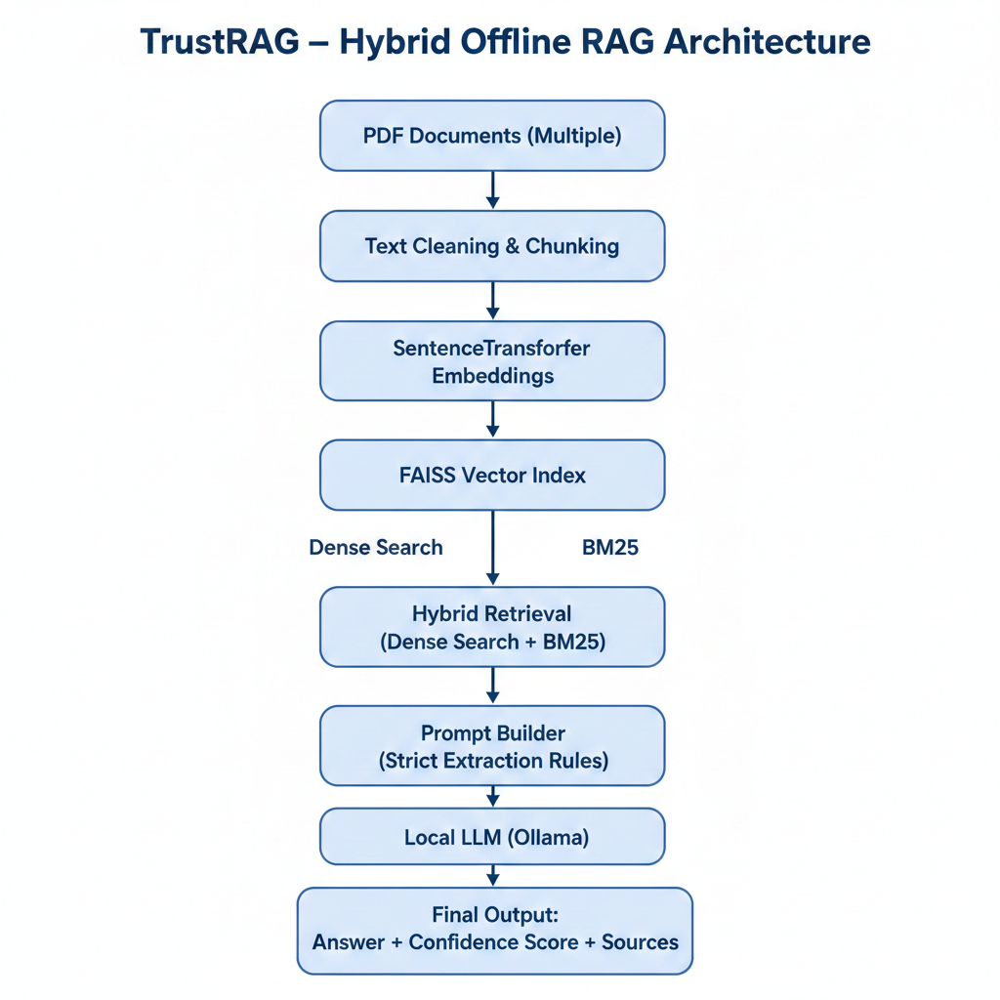
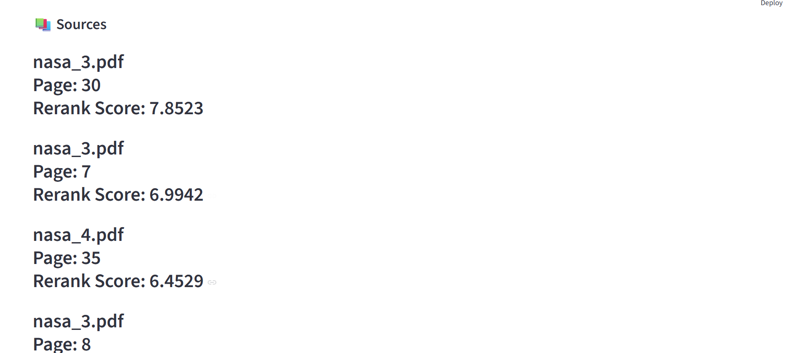

# 🚀 TrustRAG – Offline Hybrid RAG Assistant

TrustRAG is a fully offline, secure Retrieval-Augmented Generation (RAG) system designed for document-grounded question answering with hallucination control, hybrid retrieval, reranking, and confidence scoring.

It enables accurate extraction of information from technical PDFs using a local LLM (Ollama) without relying on cloud APIs.

---

##  Key Features

- ✅ Fully Offline (Local LLM via Ollama)
- ✅ Hybrid Retrieval (Dense + BM25 Sparse)
- ✅ FAISS Vector Indexing
- ✅ Cross-Encoder Reranking
- ✅ Hallucination Control Rules
- ✅ Numeric Answer Verification
- ✅ Confidence Scoring (Low / Medium / High)
- ✅ Multi-PDF Support
- ✅ Streamlit UI Interface

---

##  Architecture Overview
## 🧠 System Architecture

<p align="center">
  
</p>
---
## 📂 Project Structure

```
rag_project/
│
├── app.py                     
├── README.md
├── requirements.txt
│
├── src/
│   ├── chunk.py              
│   ├── embed.py               
│   ├── build_index.py         
│   ├── search.py             
│   ├── index.py              
│   └── rag.py              
│
├── data/
│   ├── raw_pdfs/            
│   ├── processed_chunks/     
│   └── faiss_index.index      
│
└── assets/
    ├── ui_home.png
    ├── answer_output.png
    └── architecture.png
```


## ⚙️ Tech Stack

- Python
- SentenceTransformers (all-MiniLM-L6-v2)
- CrossEncoder (ms-marco-MiniLM-L-6-v2)
- FAISS
- BM25 (rank_bm25)
- Ollama (Local LLM – Mistral / Phi3)
- Streamlit

---

## 🚀 How to Run

### 1️⃣ Activate Virtual Environment
venv\Scripts\Activate.ps1

### 2️⃣ Start Ollama
ollama serve

Make sure model is pulled:
ollama pull mistral

### 3️⃣ Run Streamlit App
streamlit run app.py

---

## 🎯 Example Use Case

Ask:

> What is the valid range of Landsat 8-9 Surface Reflectance bands?

The system:
- Retrieves relevant document chunks
- Reranks results
- Extracts exact numeric range
- Validates numbers exist in source
- Returns answer with confidence score

---

## 🧠 Hallucination Control

TrustRAG reduces hallucination by:
- Restricting model to provided context
- Verifying numeric values against source text
- Applying confidence scoring based on rerank strength
- Using hybrid retrieval for better grounding

## 🖥️ Application Screenshots

### 🔹 Streamlit Interface


---

### 🔹 Answer with Sources and Confidence


